## Capturas de la Práctica

### 1. Instalación de Java
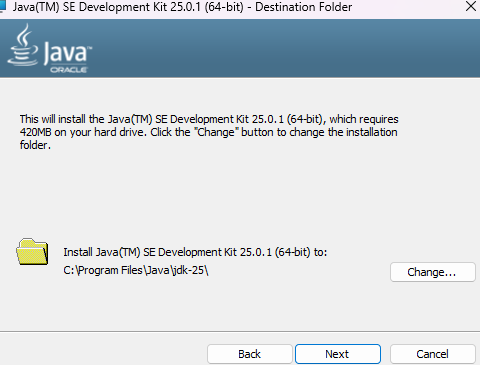

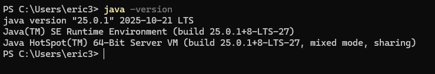

### 2. Tomcat en Ejecución
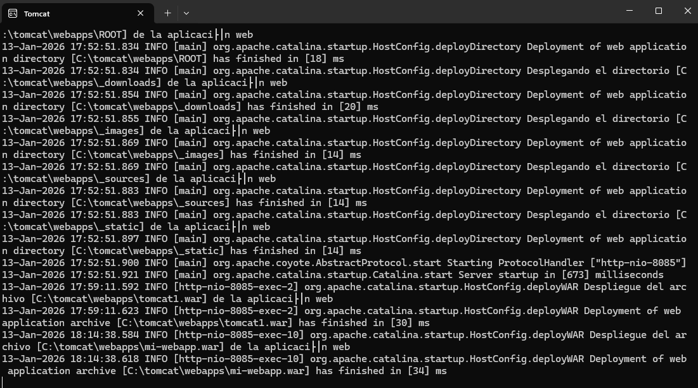

### 3. Acceso a página
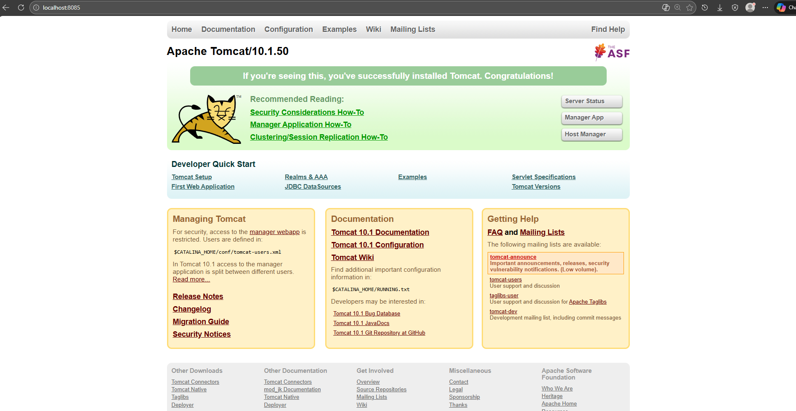

### 4. Aplicación Proporcionada (tomcat1.war)
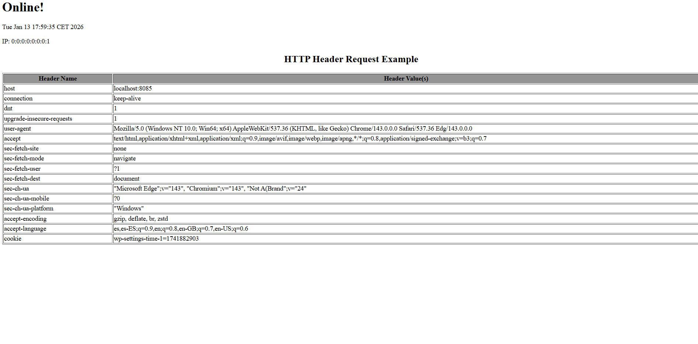

### 5. Creación de Proyecto con Maven
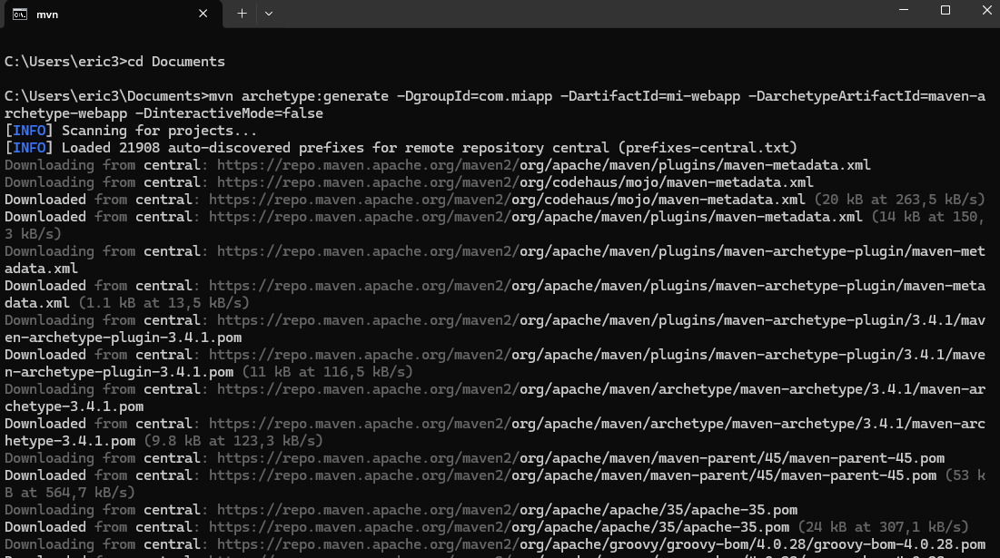

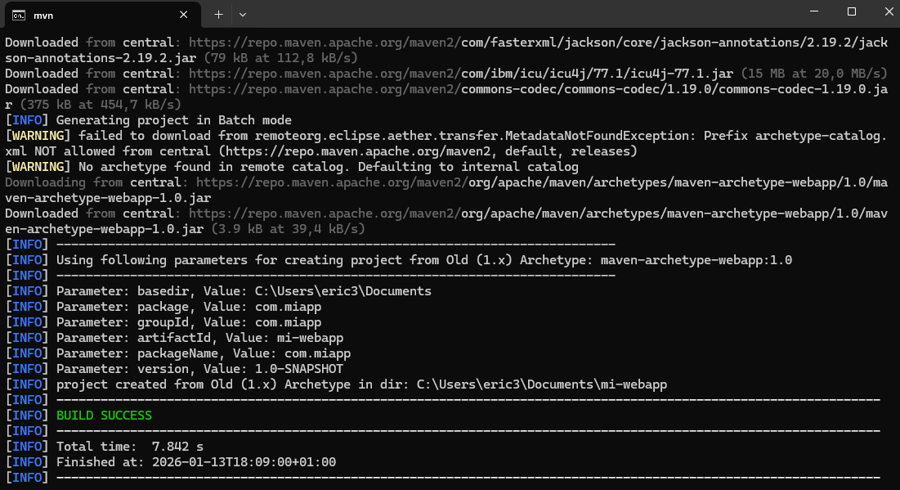

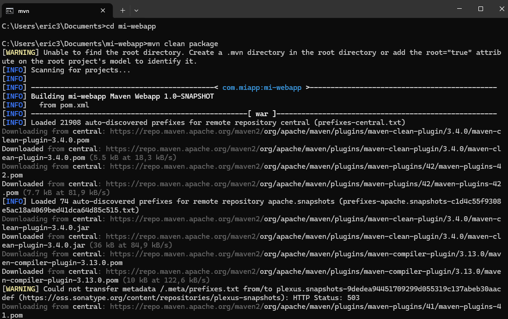

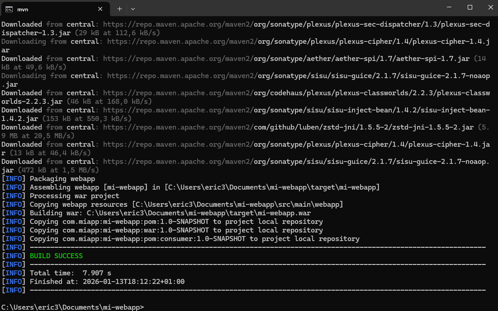

### 6. Mi Aplicación Personalizada
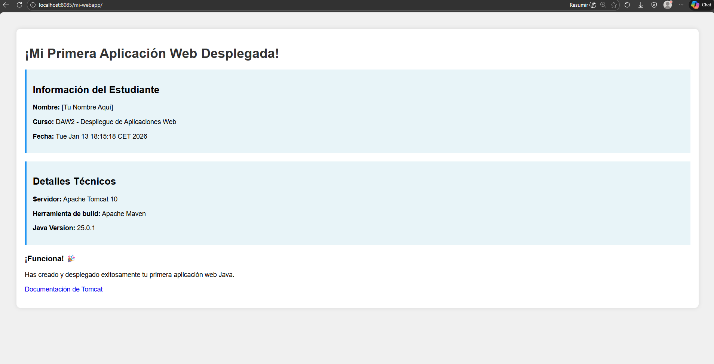

### 7. Vista de variables y Nombre del proyecto

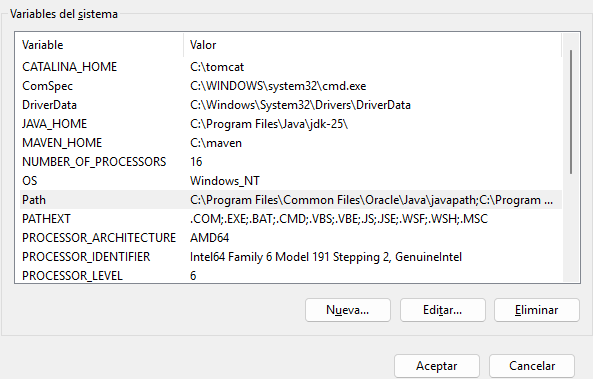

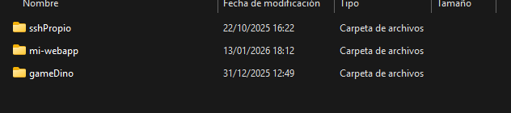